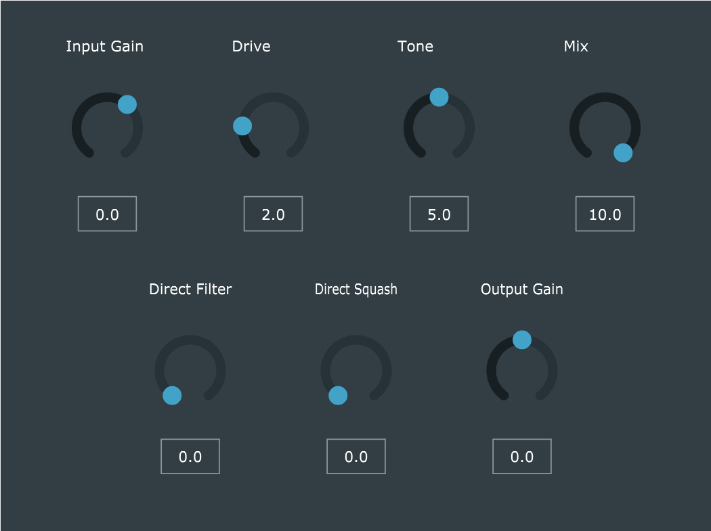
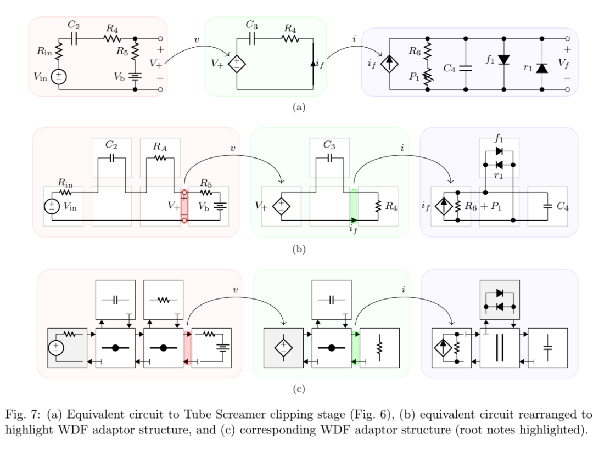
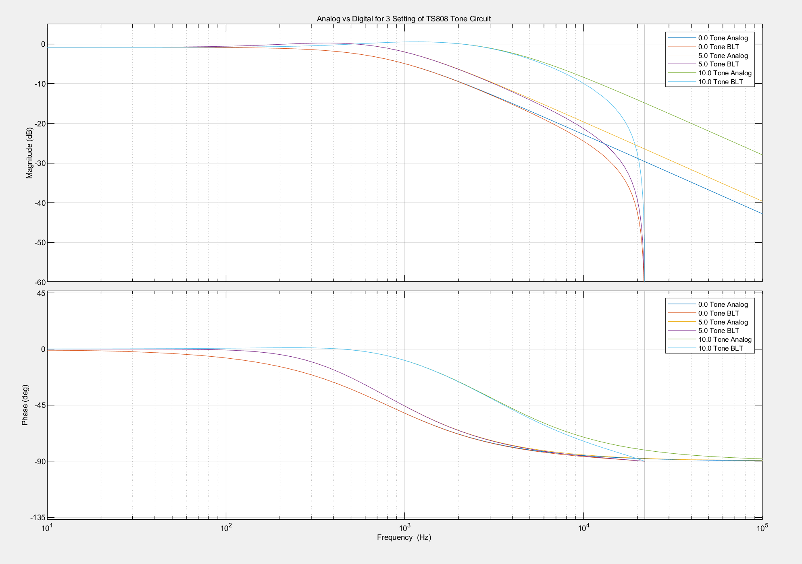
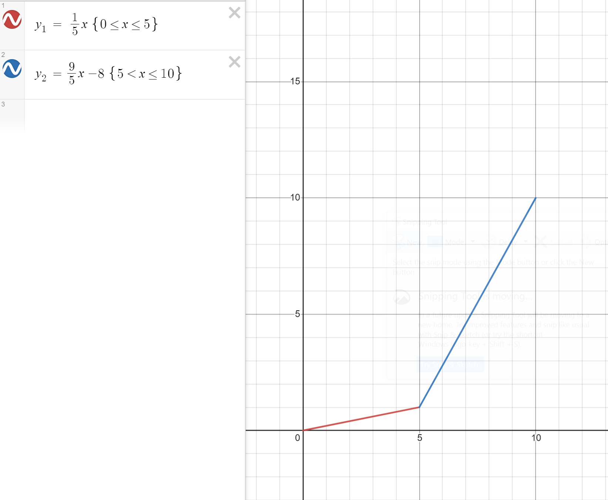
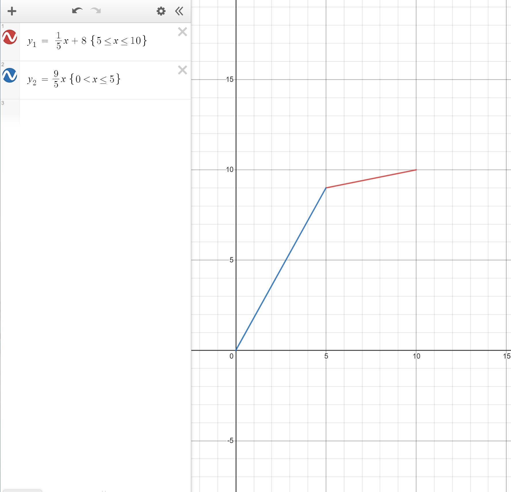

# JS-808-Ultra

Model of the classic Ibanez Tube Screamer 808 using Nodal Analysis and Wave
Digital Filters (WDF) with a few new features added!

## Basis of circuits simulated

The circuit schematics of the TS808 Ultra are based off Electrosmash's
[analysis][0].

### Clipping Circuit

Jatin Chowdury's [WDF library][1] was used to simulate the clipping stage of
the TS808. The clipping stage of the TS808 can be broken down into 3 WDF
stages based on ideal opamp circuit analysis. This is demonstrated in
[this][1] paper and is shown below:

### Tone Circuit

The tone circuit analog transfer function can be found by nodal analysis, and
is shown in section 4.3 on page 6 of [this][3] paper. The analog transfer
function can then be converted into a digital transfer function using the
bilinear transform. No frequency warping was used in the plugin, as it was
found no frequency warping produces a better sound.

A comparison between the analog and digital transfer function for the tone
circuit is seen below:

## Other features

To make the iconic tube screamer circuit more usable in applications other
than in front of a guitar amp the following is added to the plugin:

* Input Gain.
* Mix.
* Direct Low Pass Filter.
* Direct Compression.
* Output Gain.

These extra features are implemented in the digital domain.

## Potentiometers

### Drive

The drive potentiometer is modelled with the following function, which
emulates a classic audio taper potentiometer:

### Tone

According to Electrosmash's analysis, the physical Tube Screamer uses a G
taper potentiometer. However, during development, it was found an inverse log
taper allows for more control of the upper settings, so the inverse log taper
potentiometer emulation below is used in the plugin.

[0]: https://www.electrosmash.com/tube-screamer-analysis
[1]: https://github.com/jatinchowdhury18/WaveDigitalFilters
[2]: https://www.researchgate.net/publication/299514713_An_Improved_and_Generalized_Diode_Clipper_Model_for_Wave_Digital_Filters
[3]: https://dafx.de/paper-archive/2007/Papers/p189.pdf
